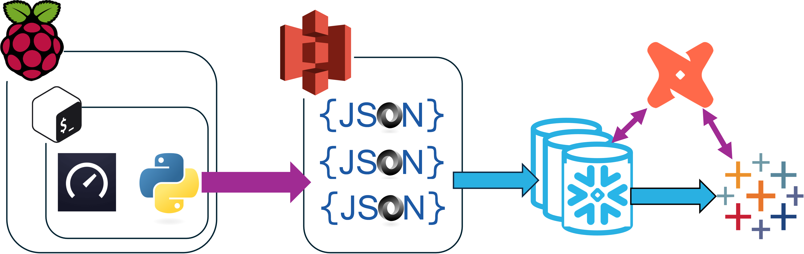

# InternetSpeedChecker

##Background
I wanted to practise an end-to-end analytical engineering project. As I had an unused Raspberry Pi I thought I could use it to check the internet speeds I get in my flat. My plan was to have a python script run on a schedule on the Raspberry Pi, checking my internet speed, then writing its results to a table in Snowflake. I wanted to practise my dbt too, so I was going to keep the data pretty raw in snowflake, and use dbt to parse the data, apply tests and documentation. Finally I'd build a simple dashboard in Tableau linking Tableau and dbt Cloud together via data health tiles and auto-exposures.

###Mistakes Made
I made a number of mistakes while making this project, and the python script I have now is **very** different from the one I started with.
Originally I used the snowflake.connector python library to insert into a snowflake table my results directly. Running this python script on an aggressive schedule resulted in an unexpectedly high credit spend in snowflake.
